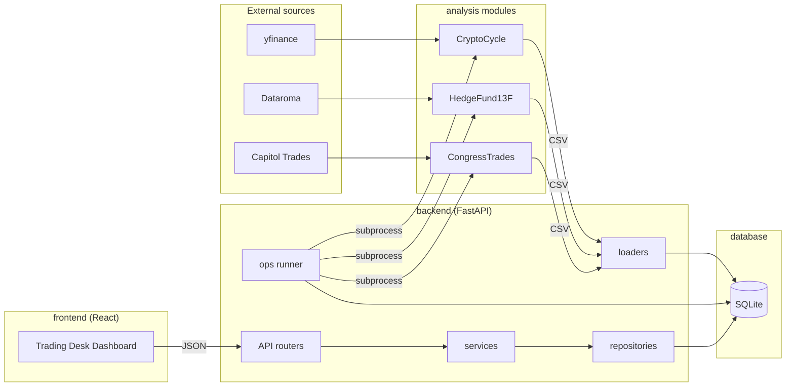
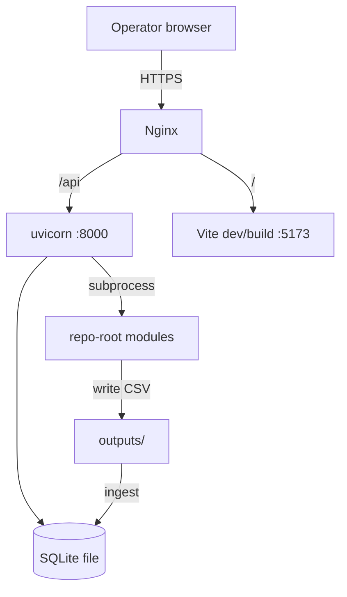
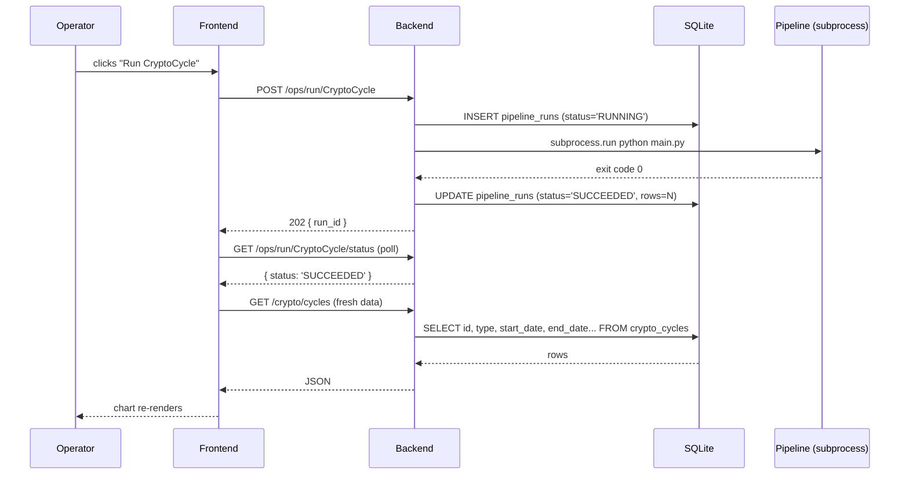
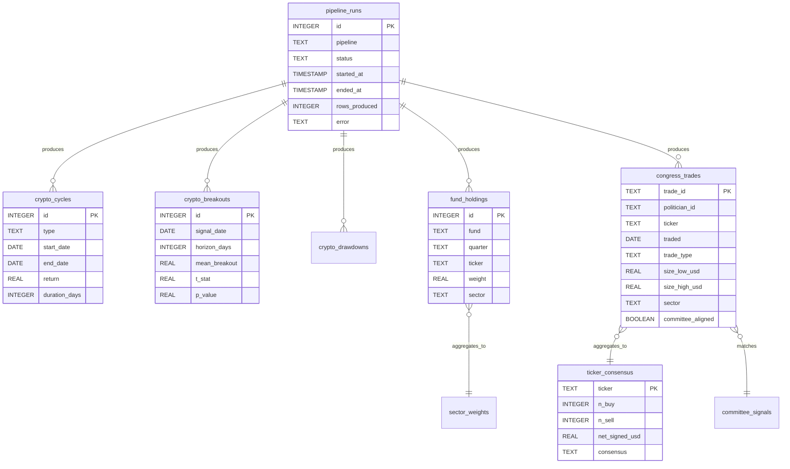
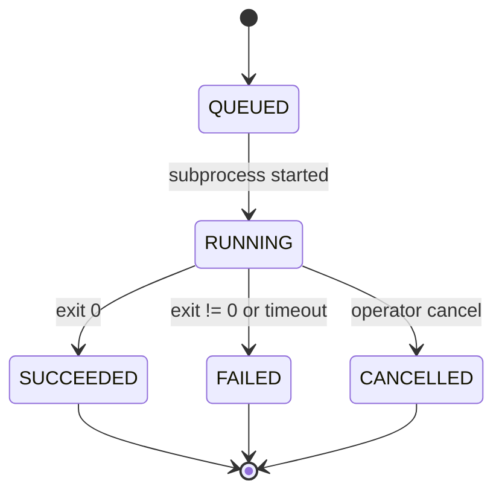
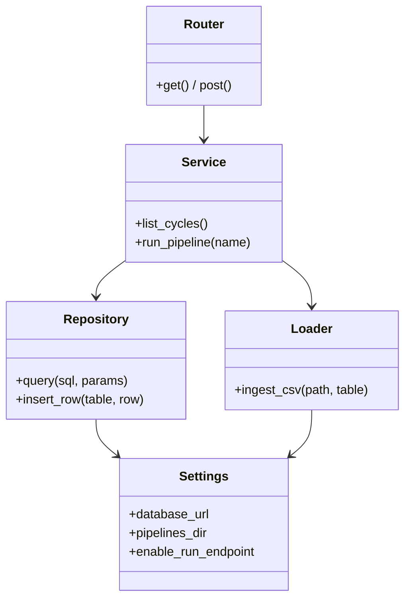
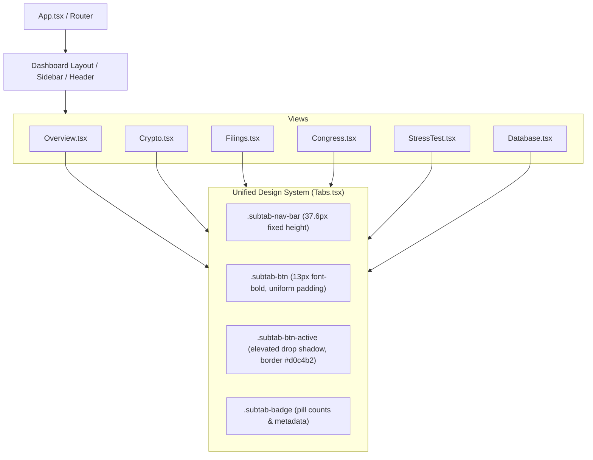
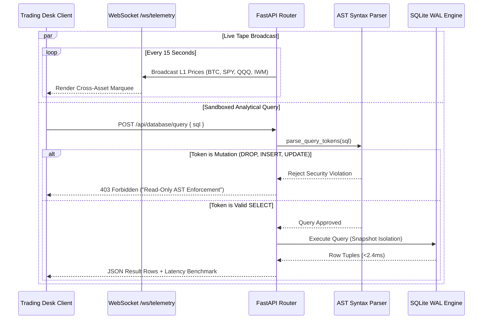

# UML Diagrams

All diagrams use [Mermaid](https://mermaid.js.org/) so they render on GitHub
and can be embedded in the Typst whitepaper.

## 1. Component diagram

## 2. Deployment diagram (single machine)

## 3. Sequence: operator triggers a pipeline run from the dashboard

## 4. Entity-relationship (database schema)

## 5. State machine: pipeline run lifecycle

## 6. Class diagram: backend layering

## 7. Frontend Subtab Architecture & Component Tree

## 8. Real-Time Telemetry & AST Guardrail Sequence

